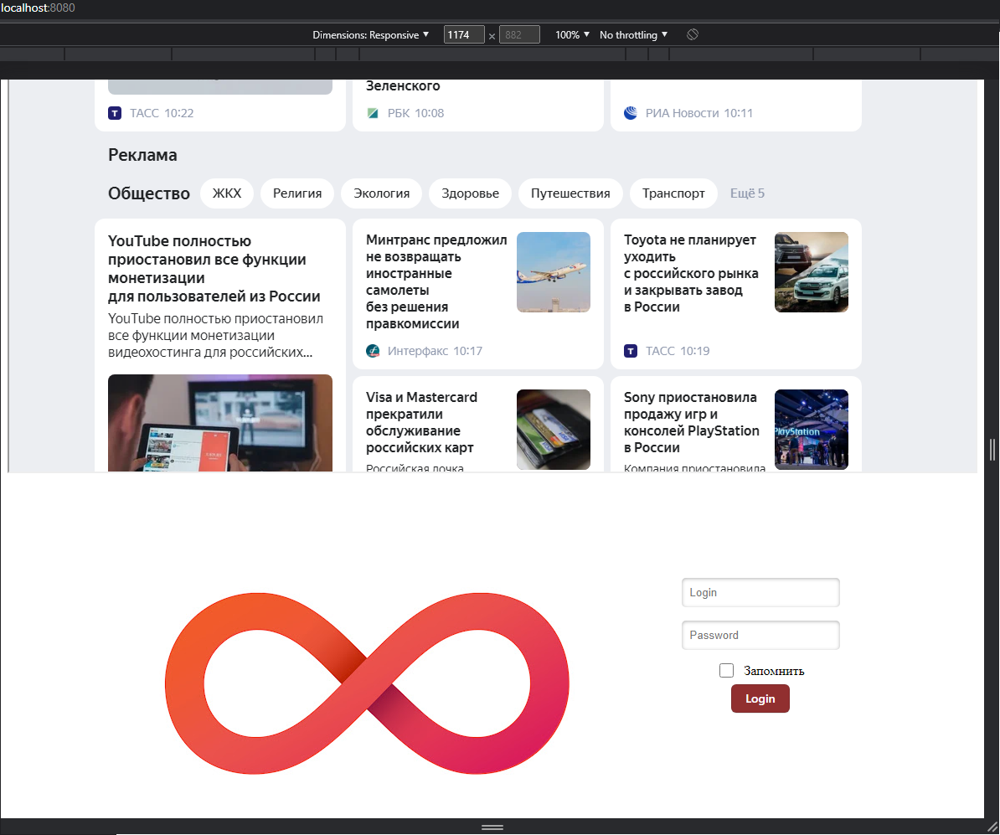
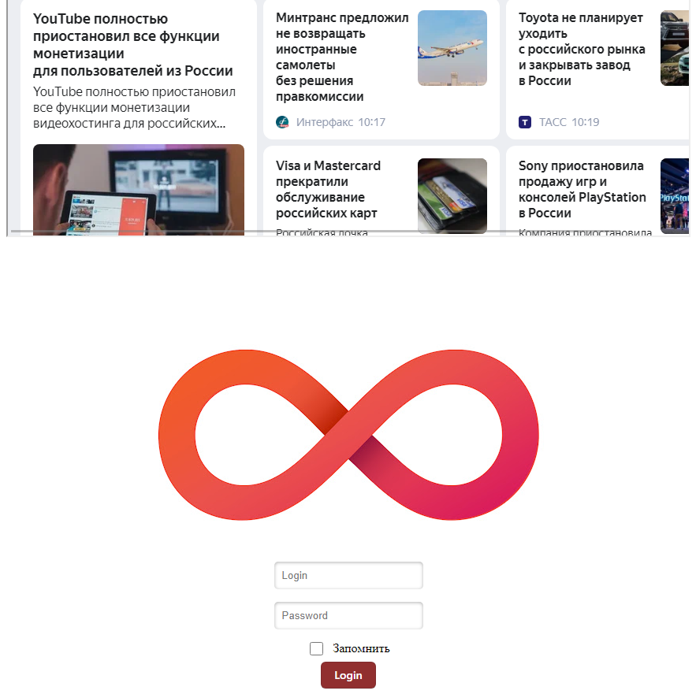

<p align = center>МИНИСТЕРСТВО НАУКИ И ВЫСШЕГО ОБРАЗОВАНИЯ

<p align = center>РОССИЙСКОЙ ФЕДЕРАЦИИ

<p align = center>ФЕДЕРАЛЬНОЕ ГОСУДАРСТВЕННОЕ БЮДЖЕТНОЕ ОБРАЗОВАТЕЛЬНОЕ УЧРЕЖДЕНИЕ ВЫСШЕГО ОБРАЗОВАНИЯ

<p align = center>«ВЯТСКИЙ ГОСУДАРСТВЕННЫЙ УНИВЕРСИТЕТ»

<p align = center>Институт математики и информационных систем

<p align = center>Факультет автоматики и вычислительной техники

<p align = center>Кафедра систем автоматизации управления

<p align = right>Дата сдачи на проверку:

<p align = right>«___» __________ 2022 г.

<p align = right>Проверено:

<p align = right>«___» __________ 2022 г.

<p align = center>Отчет по лабораторной работе № 2

<p align = center>по дисциплине

<p align = center>«Web-программирование»

<p align = center>Вариант 2


<p align = center>Разработал студент гр. ИТб-2301-01-00 ________________ /Ласкин М.В./

<p align = center>Проверил ст. преподаватель _________________ /Земцов М.А./

<p align = center>Работа защищена с оценкой «___________» «___» __________ 2022 г.


<p align = center>Киров 2022

__________
Цель:  отобразить на странице адаптивный блок авторизации

Задачи:

1. Организовать процесс работы над лабораторной работой
1. Отобразить блок авторизации на странице

Ход выполнения:

1. Организовать процесс работы над лабораторной работой

Для работы в репозитории *[ссылка на репозиторий](https://github.com/PMV-cute/Web.git)* на сайте github.com создана новая ветвь с названием lab2. Создан новый проект logpas.vue для загрузки его в основной getname.vue .

2. Отобразить блок авторизации на странице

В ходе выполнения работы был реализован блок регистрации для компьютерной версии сайта, который содержит в себе: большой логотип, который распологается слева, два поля ввода для логина и пароля и флаг "Запомнить" Отображаемый на странице блок авторизации представлен на рисунке 1.

<p align=center></p>

<p align = center>Рисунок 1 – Блок регистрации для компьютерной версии сайта

Для мобильной версии сайта на странице присутствуют все те же компоненты, что и для компьютерной. Блок авторизации для мобильных устройств отображен на рисунке 2.


<p align=center></p>

<p align = center>Рисунок 2 – Блок регистрации для мобильной версии сайта

Листинг компонента logpas.vue представлен в приложении А.

Вывод: в ходе лабораторной работы организовано рабочее пространство, закреплены навыки работы с веб-фреймворком VUE. Также были освежены знания языков разметки html и css. На практике реализован адаптивный блок авторизации.

<p align = center>2

__________

<p align = center>Приложение А

<p align = center>(обязательное) 

<p align = center>Листинг компонента logpas.vue

```html
<template>
  <section id="app">
    <div></div>
    <div>
      <div class="imput-desk">
        <div class=" text-imput">
          <input placeholder="Login" class="input" type="text" name="login"/>
        </div>
        <div class=" text-imput">
          <input placeholder="Password" class="input" type="text" />
        </div>
      </div>
      <div class="checkbox-imput">
        <input class="checkbox" type="checkbox" unchecked />
        <label class="">Запомнить</label>
      </div>
      <div id="button-div">
        <button class="button-3" role="button">Login</button>
      </div>
    </div>
  </section>
</template>

<script lang="ts">
</script>
<style>
  #app {

    display: flex;
    flex: row;
    flex-wrap: wrap;
    justify-content: center;
    align-items:center;
  }
  #button-div {
    display: flex;
    justify-content: center;
  }
  .input {
    max-width: 200px;
    height: 50%;
    margin-bottom: 8px;
    margin-top: 8px;
    color: rgb(0, 0, 0);
    border: 0;
    border-radius: 5px;
    box-shadow: inset 0 1px 4px rgba(0, 0, 0, 0.3), 0 1px rgba(255, 255, 255, 0.06);
    padding: 10px;
  }
  .text-imput {
    display: flex;
    width: 300px;
    align-items: center;
    justify-content: center;
  }
  .checkbox-imput {
    display: flex;
    align-items: center;
    justify-content: center;
  }
  .checkbox {
    width: 17px;
    height: 17px;
    margin-top: 8px;
    margin-right: 12px;
    margin-bottom: 8px;
    cursor: pointer;
  }
  .checkbox:disabled{
    cursor: default;
  }

  /* CSS */
  .button-3 {
    appearance: none;
    background-color: #912f2f;
    border: 1px solid rgba(27, 31, 35, 0.15);
    border-radius: 6px;
    box-shadow: rgba(27, 31, 35, 0.1) 0 1px 0;
    box-sizing: border-box;
    color: #fff;
    cursor: pointer;
    display: inline-block;
    font-family: -apple-system, system-ui, 'Segoe UI', Helvetica, Arial,
      sans-serif, 'Apple Color Emoji', 'Segoe UI Emoji';
    font-size: 14px;
    font-weight: 600;
    line-height: 20px;
    padding: 6px 16px;
    position: relative;
    text-align: center;
    text-decoration: none;
    user-select: none;
    touch-action: manipulation;
    vertical-align: middle;
    white-space: nowrap;
  }

  .button-3:focus:not(:focus-visible):not(.focus-visible) {
    box-shadow: none;
    outline: none;
  }

  .button-3:hover {
    background-color: #c96159;
  }

  .button-3:focus {
    box-shadow: rgba(46, 164, 79, 0.4) 0 0 0 3px;
    outline: none;
  }

  .button-3:disabled {
    background-color: #912f2f;
    border-color: rgba(27, 31, 35, 0.1);
    color: rgba(255, 255, 255, 0.8);
    cursor: default;
  }

  .button-3:active {
    background-color: #eb817a;
    box-shadow: rgba(20, 70, 32, 0.2) 0 1px 0 inset;
  }

</style>
```