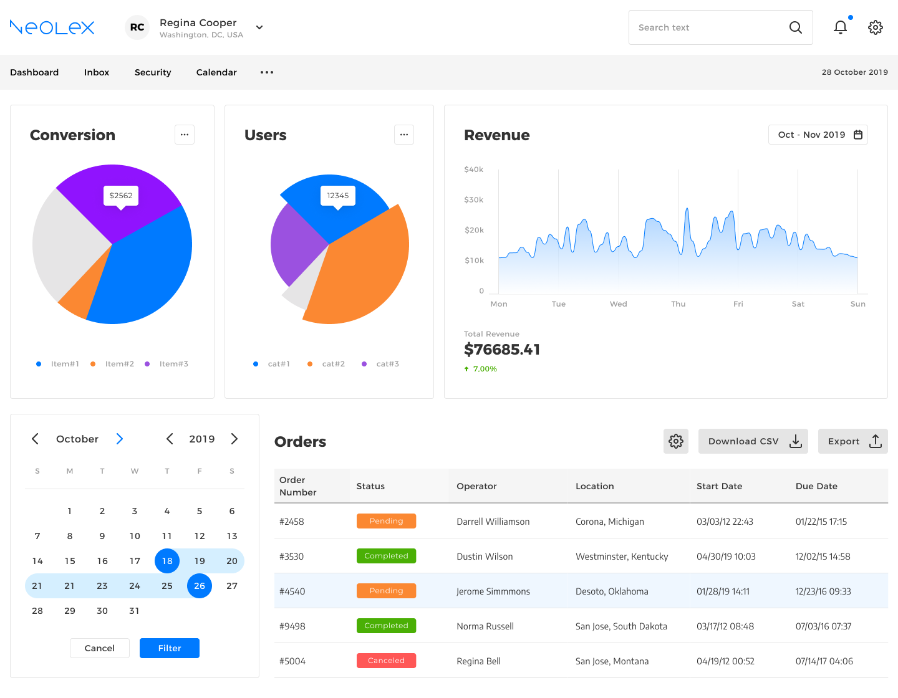
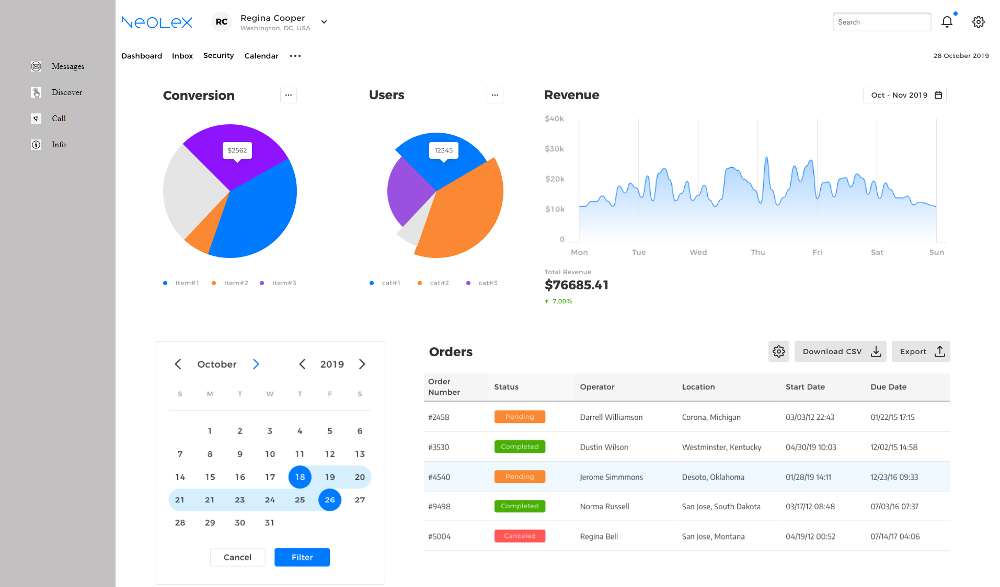
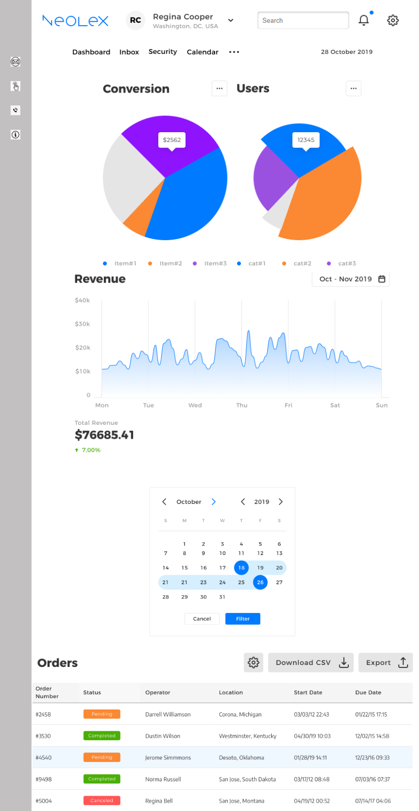

<p align = center>МИНИСТЕРСТВО НАУКИ И ВЫСШЕГО ОБРАЗОВАНИЯ
<p align = center>РОССИЙСКОЙ ФЕДЕРАЦИИ
<p align = center>ФЕДЕРАЛЬНОЕ ГОСУДАРСТВЕННОЕ БЮДЖЕТНОЕ ОБРАЗОВАТЕЛЬНОЕ УЧРЕЖДЕНИЕ ВЫСШЕГО ОБРАЗОВАНИЯ
<p align = center>«ВЯТСКИЙ ГОСУДАРСТВЕННЫЙ УНИВЕРСИТЕТ»
<p align = center>Институт математики и информационных систем
<p align = center>Факультет автоматики и вычислительной техники
<p align = center>Кафедра систем автоматизации управления
<p align = right>Дата сдачи на проверку:
<p align = right>«___» ________________ 2022 г.
<p align = right>Проверено:
<p align = right>«___» ________________ 2022 г.
<p align = center >Отчет по лабораторной работе № 4
<p align = center>по дисциплине
<p align = center>«Web-программирование»
<br/>
<br/>
<br/>
<br/>
<br/>

<p align = right>Разработал студент гр. ИТб-2301-01-00 __________________ /Ласкин М.В./
<p align = right>Проверил преподаватель _________________ /Земцов М.А./
<p align = right>Оценка работы	«___________» 
«____»_____________ 2022 г.
<br/>
<br/>
<br/>
<br/>
<br/>
<p align = center>Киров 2022
<br/><br/>

<p align = justify style="text-indent: 25px;">Цель: создать макет дашборда с применением компонентов фреймворка
<br/><br/>

<p align = justify style="text-indent: 25px;">
Задачи:

1. Организовать процесс работы над лабораторной работой
1. Реализовать верстку
1. Сделать адаптив для мобильных устройств
<br/><br/>

<p align = justify style="text-indent: 25px;">Ход выполнения:

1. Организовать процесс работы над лабораторной работой.

Для работы в репозитории _[ссылка на репозиторий](https://github.com/PMV-cute/Web.git)_ на сайте github.com была создана новая ветвь с названием Lab4.
<p align = justify style="text-indent: 25px;">
2. Реализовать верстку
<p align = justify style="text-indent: 25px;">Образец дашборда предствален на рисунке 1. Конечный результат верстки отображен на рисунке 2. Листинг основных компонентов приведен в приложениях А, Б, В, Г.
<br><br>

<p align=center></p>
<p align = center>Рисунок 1 - Макет дашборда
<br><br>
<p align=center></p>
<p align = center>Рисунок 2 - Образец готовой верстки
<br><br>


3. Сделать адаптив для мобильных устройств
<p align = justify style="text-indent: 25px;">
В ходе выполнения работы были сделана адаптация страницы под мобильные устройства.

<p align=center></p>
<p align = center>Рисунок 3 - Адаптация для телефонов
<br><br>


<p align = justify style="text-indent: 25px;">Вывод: в ходе выполнения работы были повторены навыки верстики сайтов, опробован метод верстки с применением компонентов.
<br><br>


<p align = center>Приложение А

<p align = center>(обязательное)
<p align = center> Листинг компонента top_bar

```html
<template>
  <div class="main_cont">
      <div class="top_">
        <div class="top_left">
          
          
        </div>
        <div class="top_right">
            <input placeholder="Search" class="input" type="text"/>
            
            
        </div>
      </div>
    <div class="top_">
        <div class="top_left_b">
          
          
          
          
          
        </div>
        <div class="top_right_b">
            
        </div>
    </div>
  </div>

</template>

<script lang="ts">

</script>

<style>
.main_cont{
    padding: 2px;
    width: 100%;
}
.top_{
    display: flex;
    flex: row;
    flex-wrap: wrap;
    align-content: center;
    height: auto;
}
.top_left{
    display: flex;
    height: 80px;
    margin-right: auto;
}
.top_right{
      display: flex;
    height: 80px;
    margin-left: auto;
}
.top_left_b{
    display: flex;
    height: 50px;
    margin-right: auto;
}
.top_right_b{
    display: flex;
    height: 50px;
    margin-left: auto;
}
.img_{
    padding: 10px;
    margin: auto 0 auto 0;
    
}

.input {
    max-width: 200px;
    height: 20%;
    color: rgb(0, 0, 0);
    border: 0;
    border-radius: 5px;
    box-shadow: inset 0 1px 4px rgba(0, 0, 0, 0.3), 0 1px rgba(255, 255, 255, 0.06);
    padding: 10px;
    margin: auto 0 auto 0;
  }
  @media (max-width: 1200px) {
    .top_left_b{
        margin: auto;
    } 
    .top_right_b {
        margin: auto;
    }
    .top_left{
        margin: auto;
    }
    .top_right{
        margin: auto;
    }
}
</style>

```

<br><br>

<p align = center>Приложение Б

<p align = center>(обязательное)
<p align = center> Листинг компонента middle_bar

```html
<template>
  <div class="main_cont1">
      <div class="middle_">
          <div class="circles_">
              <div class="circle_1">
                  <div class="circle_1_bar_1">
                      
                      
                  </div>
                  <div class="items_">
                      
                  </div>
                  <div class="items_">
                      
                      
                      
                  </div>
              </div>
              <div class="circle_1">
                  <div class="circle_1_bar_1">
                      
                      
                  </div>
                  <div class="items_">
                      
                  </div>
                  <div class="items_">
                      
                      
                      
                  </div>
              </div>
          </div>
          <div class="circles_">
              <div class="diagram_1">
                  <div class="circle_1_bar_1">
                      
                      
                  </div>
                  <div class="diagram_">
                      
                  </div>
                  <div class="middle_value">
                      
                  </div>
              </div>
          </div>
      </div>
  </div>

</template>

<script lang="ts">

</script>

<style>
.main_cont1{
    padding: 2px;
    width: 100%;
}
.middle_{
    width: 100%;
    display: flex;
    height: auto;
    flex-wrap: wrap;
    padding: 20px;
}
.circles_{
    display: flex;
    flex-wrap: wrap;
    width: 47%;
    justify-content: space-around;
}
.circle_1{
    padding: 10px;
}
.diagram_1{
    padding: 10px;
    width: 100%;
}
.diagram_{
    display: flex;
    margin-top: 20px;
    justify-content: space-around;
}
.diagram_img{
    width: 100%;
    height: auto;
}
.middle_value{
    margin-top: 20px;
}
.items_{
    display: flex;
    justify-content: space-between; 
    margin-top: 40px;
}
.circle_1_bar_1{
    display: flex;
    justify-content: space-between; 
}
.img__{
    margin: auto 0 auto 0 ;
}
  @media (max-width: 1200px) {
    .circle_1_bar_1{
        margin: auto;
    } 
    .middle_{
        
        justify-content: center;
    }
    .circles_{
        width: auto;
        justify-content: center;
    }
}
</style>

```
<p align = center>Приложение В

<p align = center>(обязательное)
<p align = center> Листинг компонента bottom_bar

```html
<template>
  <div class="main_cont2">
      <div class="bottom_">
          <div class="calendar_">
              <div class="calendar_1">
                  
              </div>
              
          </div>
          <div class="data_">
            <div class="bottom_bar">
                
                <div class="bottom_bar_right">
                    
                    
                    
                </div>
                
            </div>
            <div class="table_">
                
            </div>
              
          </div>
      </div>
  </div>

</template>

<script lang="ts">

</script>

<style>
.main_cont2{
    padding: 2px;
    width: 100%;
}
.bottom_{
    width: 100%;
    display: flex;
    height: auto;
    flex-wrap: wrap;
    padding: 0px;
}
.calendar_{
    width: 35%;
    display: flex;
    justify-content: space-around;
    margin-top: 30px;
}
.calendar_1{
    width: 75%;
}
.data_{
    flex-wrap: wrap;
    width: 60%;
    margin-top: 30px;
}
.img_auto{
    width: 100%;
    height: auto;
}
.bottom_bar{
    display: flex;
    flex-wrap: wrap;
    justify-content: space-between; 
}
.bottom_bar_right{
    display: flex;
}
.img_bar{
    margin: auto 0 auto 10px;
}
.table_{
    display: flex;
    justify-content:space-around;
    margin-top: 20px;
}
  @media (max-width: 1200px) {
    .data_ ,.calendar_{
        width: auto;
        justify-content: center;
    }
    .bottom_{
        justify-content: center;
    }
}
</style>

```
<p align = center>Приложение Г

<p align = center>(обязательное)
<p align = center> Листинг компонента left_menu

```html
<template>
  <div class="main_cont3">
      <div class="left_">
          <div class="left_menu">
              <div class="li">
                  
                <p>Messages</p>
                </div>
              <div class="li">
                  
                <p>Discover</p>
                </div>
                <div class="li">
                  
                <p>Call</p>
                </div>
                <div class="li">
                  
                <p>Info</p>
                </div>
          </div>
          
      </div>
  </div>

</template>

<script lang="ts">

</script>

<style>
.main_cont3{
    padding: 2px;
    width: 100%;
    background-color: rgb(194, 192, 192);
}
.left_{
    width: 100%;
    display: flex;
    height: auto;
    flex-wrap: wrap;
    padding: 0px;
    justify-content: center;
}
.left_menu{
    display: flex;
     flex-direction: column;
     margin-top: 100px;
}
.img_auto1{
    width: 20px;
    height: 20px;
    margin: auto 0;
}
.li{
    display: flex;
    height: 50px;
}
p {
    margin: auto 0 auto 20px;
    
}
  @media (max-width: 1200px) {
    p {
        display: none;
    }
}
</style>

```